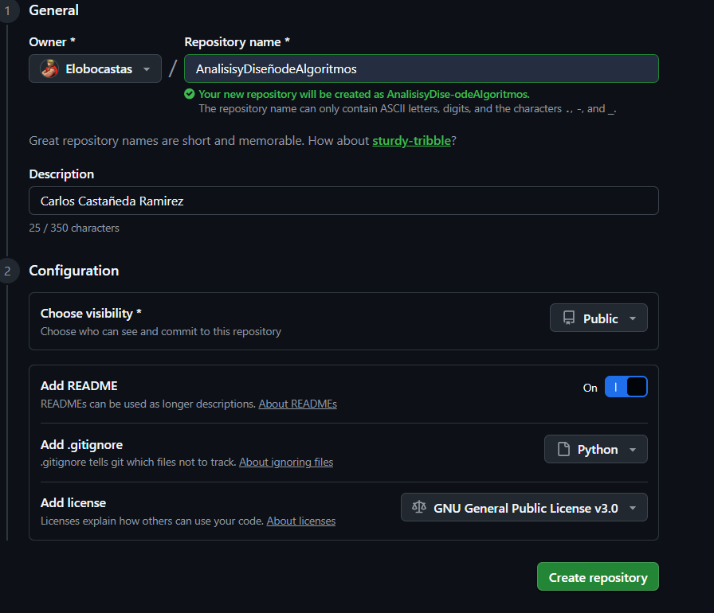
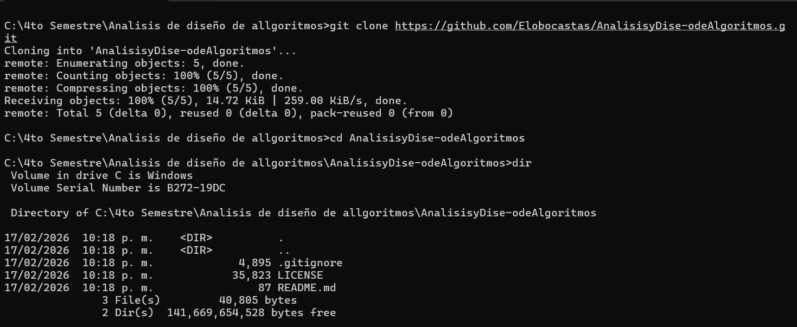

# AnalisisyDise-odeAlgoritmos

## Análisis y Diseño de Algoritmos
Este repositorio contiene las prácticas y ejercicios de la materia.

### Datos del Alumno
* **Nombre:** Carlos Castañeda Ramírez
* **Matricula:** 42104454
* **Evaluación:** [Repositorio]

---

##  Tutorial: Creación del Repositorio

### Paso 1: Configuración en GitHub
Se creó el repositorio con el nombre **AnalisisyDisenodeAlgoritmos**, incluyendo un archivo `.gitignore` para Python y la licencia **GNU GPL v3**.





### Paso 2: Clonación en nuestra carpeta 
Utilicé la terminal para clonar el repositorio localmente en la carpeta que queria el repositorio:
```bash
git clone [https://github.com/Elobocastas/AnalisisyDise-odeAlgoritmos.git](https://github.com/Elobocastas/AnalisisyDise-odeAlgoritmos.git)

